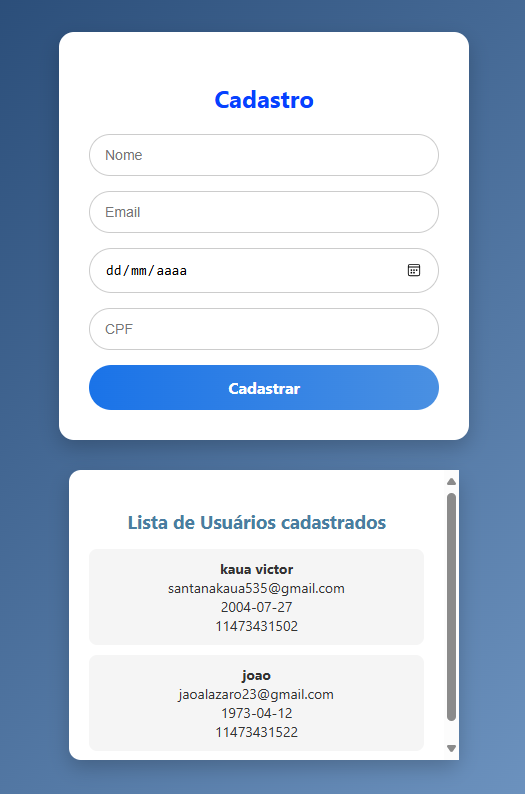

# 📋 Sistema de Cadastro de Usuários

Um sistema completo de cadastro e listagem de usuários desenvolvido para aprofundar conhecimentos em desenvolvimento fullstack, integração com banco de dados e construção de APIs RESTful.

## ✨ Funcionalidades

- ✅ **Cadastro de usuários** com validação de dados
- ✅ **Listagem em tempo real** dos usuários cadastrados
- ✅ **Interface intuitiva** com feedback visual imediato
- ✅ **Persistência de dados** em banco MySQL
- ✅ **API REST** completa para operações CRUD

## 🎯 Objetivo do Projeto

Este projeto foi desenvolvido com o propósito de aprender e praticar:
- Integração entre **Frontend (React)** e **Backend (Node.js/Express)**
- Operações **CRUD** com banco de dados **MySQL**
- Configuração de variáveis de ambiente e segurança básica
- Desenvolvimento de **APIs RESTful**
- Estruturação de projetos fullstack

## 🛠️ Tecnologias Utilizadas

### Backend
- **Node.js** - Ambiente de execução JavaScript
- **Express.js** - Framework web para Node.js
- **MySQL2** - Driver para conexão com MySQL
- **CORS** - Middleware para habilitar cross-origin requests
- **Body-Parser** - Middleware para parsing de requisições
- **Dotenv** - Gerenciamento de variáveis de ambiente

### Banco de Dados
- **MySQL** - Sistema de gerenciamento de banco de dados relacional

### Frontend
- **React** - Biblioteca JavaScript para interface do usuário
- **CSS** - Estilização e design responsivo

## 📁 Estrutura do Projeto
```
meu-projeto/
├── backend/
│ ├── server.js # Servidor principal e configurações
│ ├── database.js # Configuração e conexão com MySQL
│ ├── routes/ # Definição das rotas da API
│ ├── controllers/ # Lógica de negócio
│ ├── .env # Variáveis de ambiente
│ └── package.json
└── frontend/
├── src/
│ ├── components/ # Componentes React reutilizáveis
│ ├── services/ # Comunicação com a API
│ ├── App.js # Componente principal
│ ├── App.css # Estilos principais
│ └── index.js # Ponto de entrada
└── package.json
```

## 🎨 Interface do Usuário

A interface foi cuidadosamente desenvolvida para proporcionar uma experiência intuitiva:

- **Formulário de cadastro** na parte superior da página
- **Lista atualizada automaticamente** com todos os usuários cadastrados
- **Design responsivo** que se adapta a diferentes dispositivos
- **Feedback visual** imediato para todas as ações do usuário

## ⚙️ Configuração do Banco de Dados

1. Crie o banco de dados no MySQL:

```sql
CREATE DATABASE cadastro_usuarios;
```
As tabelas serão criadas automaticamente pelo sistema na primeira execução

## Variáveis de Ambiente
Na pasta backend, crie um arquivo **.env** com:
```
DB_HOST=localhost
DB_USER=seu_usuario
DB_PASSWORD=sua_senha
DB_NAME=cadastro_usuarios
DB_PORT=3306
SERVER_PORT=5000
```
## Exemplo de Uso
1)Preencha o formulário de cadastro com:
- **Nome**
- **Email**
- **Data de Nascimento**
- **CPF**

2)Observe a lista abaixo sendo atualizada automaticamente com o novo usuário

3)Preview da Interface




## Fluxo de Dados
- Frontend → Envia dados do formulário para a API

- Backend → Recebe, valida e armazena no MySQL

- Backend → Retorna confirmação para o Frontend

- Frontend → Atualiza a lista local e exibe feedback

## Estrutura da Tabela
```sql
CREATE TABLE usuarios (
    id INT AUTO_INCREMENT PRIMARY KEY,
    nome VARCHAR(100) NOT NULL,
    email VARCHAR(100) UNIQUE NOT NULL,
    data_nascimento DATE NOT NULL,
    cpf VARCHAR(14) NOT NULL
);
```
## Próximas Melhorias
- Autenticação e autorização de usuários

- Paginação na listagem de usuários

- Busca e filtros avançados

- Upload de fotos de perfil

- Validações mais robustas no frontend e backend

- Testes automatizados

## Licença
Este projeto é open source e está disponível sob a licença MIT. Desenvolvido para fins educacionais e de aprendizado

### Desenvolvido com ❤️ para aprender sobre desenvolvimento fullstack e integração com banco de dados
